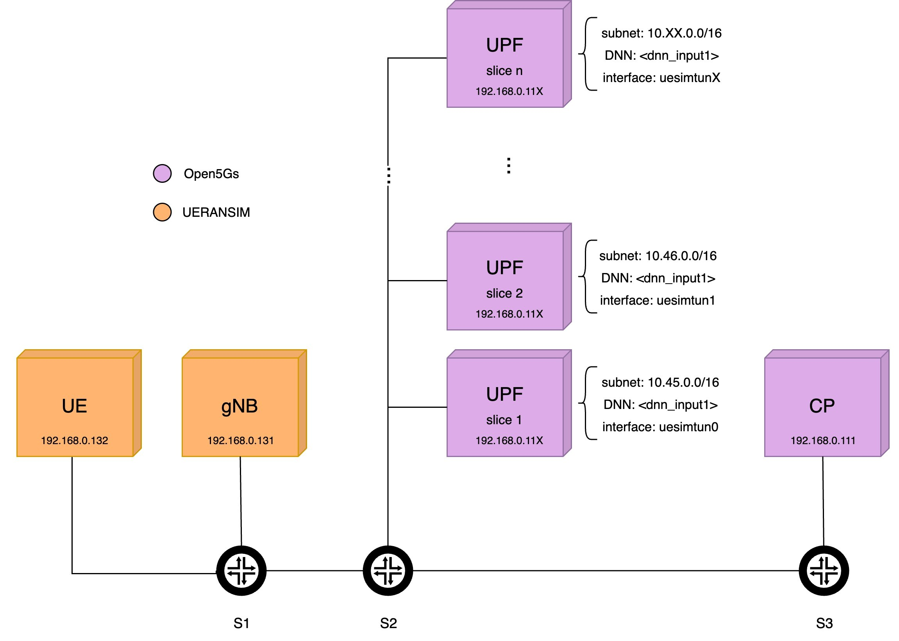

# Automatic creation of slices
Based on the already existing [5G network emulator](https://github.com/fabrizio-granelli/comnetsemu_5Gnet), with an added new functionality:
**Implementation of a command line interaction for automatic slice creation.** 

## Prerequisites

Tested Versions:
- Comnetsemu: v0.3.0 (Installed following either "Option 1" or "Option 3" from [here](https://git.comnets.net/public-repo/comnetsemu) )
- UERANSIM: v3.2.6
- Open5gs: v2.4.2

Necessary Python packages:
- pymongo
- json
- pyyaml

## Build Instructions

1. Clone repository in the comnetsemu VM, into ~/comnetsemu/app folder.
```
cd ~/comnetsemu/app 
git clone https://github.com/martamorg/5G_Project.git
```
**Note:** make sure variables **prj_folder** and **mongodb_folder** (lines 22 and 23 of the example script) are correct. They may change depending on your installation method or original repository.

2. Download the necessary docker images:

```
cd build
./dockerhub_pull.sh
```


## Run automatic slice creation simulator

### Our topology
The topology is very similar to the one in the original repository. Basically each of the elements in our network runs in a separate Docker host.

This means that we will have 3 basic hosts (UE, gNB and CP), plus one additional host per slice (UPF).
A PDU session will be initiated for each slice.
The current configuration links all UPF docker hosts to the second switch (S2). 

</img>


### Running the example script
```bash
$ sudo python3 example4.py
```

#### Configuring the slices

When running the script, you will be prompted through the command line to insert the necessary data to personalize your desired slice configuration. 
First we will be asked the desired number of slices. Then, for each slice, the necessary fields are: 
- **DNN** (Data Network Name): it's the counterpart of APN in LTE. It is used to identify and route traffic to a specific network slice.
- **Bandwidth**: indicates the session AMBR (Aggregate Maximum Bit Rate) in Mbps. For now, we apply the same value downlink and uplink.

The values for subnet and IP addresses will be automatically assigned as showed in the topology. 

An example of a possible command line interaction for the configuration of a single slice would be the following: 
```bash
$ sudo python3 example4.py
enter number of slices: 1
enter dnn for slice 1: internet
enter bandwidth (Mbps) for slice 1: 2
```

Once the personalized details have been inserted, the program automatically writes the necessary values in the network function protocol and component configuration YAML files: 
- SMF (Session Management Function)
- AMF (Access & Mobility Management Function)
- NSSF (Network Slice Selection Function)
- UE (User Equipment)
- GNB (gNodeB Station)
- UPF (User Plane Function)

The configuration would result as follows:

```
Slice 1 configuration
- SST: 1
- SD: 000001
- DNN: internet
- Session-AMBR Downlink: 2 Mbps
- Session-AMBR Uplink: 2 Mbps
```

#### Setting up the network


After a while, the Docker hosts will be created, subscriber information will be updated and applied, and the topology will be initiated using Mininet. 

Once the network has been started, some automatic tests will be performed to check everything is working as expected.

#### Testing the network

Notice how the UE Docker host has been initiated running `open5gs_ue_init.sh` which, based on the configuration provided in `open5gs-ue.yaml`, creates the UE connections.
The sessions are started specifying the slice, not the APN. The APN, and thus the associated UPF, is selected by the 5GC since, in `subscriber_profile.json`, a slice is associated to a session with specific DNN.

The program enters the UE container and verifies the UE connections by running:

``` 
$ ue ifconfig
``` 

You will be able to see the output of the command. There, you should find an interface for every defined slice. Each of those configurations should look similar to the following:

```
uesimtun0: flags=369<UP,POINTOPOINT,NOTRAILERS,RUNNING,PROMISC>  mtu 1400
        inet 10.45.0.2  netmask 255.255.255.255  destination 10.45.0.2
        unspec 00-00-00-00-00-00-00-00-00-00-00-00-00-00-00-00  txqueuelen 500  (UNSPEC)
        RX packets 0  bytes 0 (0.0 B)
        RX errors 0  dropped 0  overruns 0  frame 0
        TX packets 0  bytes 0 (0.0 B)
        TX errors 0  dropped 0 overruns 0  carrier 0  collisions 0
```

The program will also start a **ping test** from each interface to **check connectivity**.
(We should keep in mind that the program will perform these tests for each of the slices. Here we can only find the example command run for a single slice for simplicity):
``` 
# ue ping -c 3 -n -I uesimtun0 www.google.com
``` 

Finally, a **bandwidth test** is started:
``` 
# ue iperf3 -c 10.45.0.1 -B 10.45.0.2 -t 5
``` 

You should be able to observe how the data-rate follows the maximum data-rate specified for the slices as an input.


#### To further test the environment

Those are all the automatic tests performed by the program, but we can further test our environment as suggested in the original repo. 

### Contact

Automatic slice creation: 
- Marta Moreno - marta.moreno@studenti.unitn.it

Supervised by: 
- Fabrizio Granelli - fabrizio.granelli@unitn.it

Main maintainer:
- Riccardo Fedrizzi - rfedrizzi@fbk.eu


